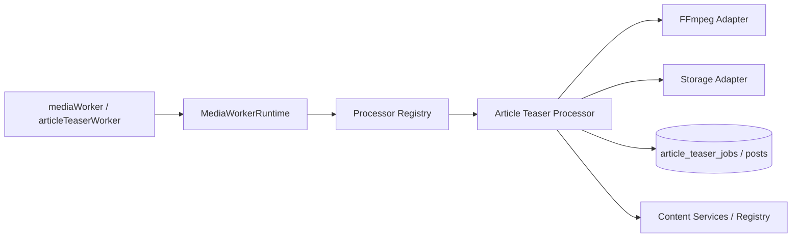

# Media Processing Foundation V1

**Status:** Implemented on `alpha-0.2` (local; not committed)  
**Parent tip:** Unified Content Services V2 (`32fb362`)  
**Migrations:** None — reuses `article_teaser_jobs` (`20260867`)

---

## 1. Purpose

A domain-agnostic **Media Processing Runtime** that dispatches jobs to registered Processors. Article Teaser is the first processor; Course / Product / Image / AI processors can be added without changing Runtime.



## 2. Runtime

- Job Dispatcher (`dispatchOnce` / `loop`)
- Graceful shutdown (`SIGINT` / `SIGTERM` → `requestShutdown`)
- Progress reporting (in-memory state machine)
- Metrics hooks + structured logging
- Temp workspace create/cleanup always in `finally`
- Idempotent processor short-circuits supported

Runtime never imports article domain types.

## 3. Processor interface

`validate → claim → execute → finalize | fail → cleanup`  
Plus `isRetryEligible` and `maxAttempts`.

## 4. Registry

Allowlist kinds only. Duplicate registration throws. Unknown kind fails (no fallback).

## 5–6. Adapters

- **FFmpeg:** validate args, spawn, timeout, exit mapping, stderr capture
- **Storage:** temp workspace, download HTTP/storage, upload, cleanup

## 7–9. Retry / Progress / Failure

- Retry: permanent vs retryable + exponential backoff delay (no new scheduler)
- Progress: pending → claimed → processing → uploading → finalizing → ready | failed
- Failure: mark failed with sanitized code, cleanup temps, do not delete domain rows

## 10–11. Logging / Metrics

JSON logs with secret redaction. Counters: started / completed / failed / retries / duration sum.

## Entry points

```bash
npm run media:worker:once
npm run teaser:worker:once   # compat wrapper
```
