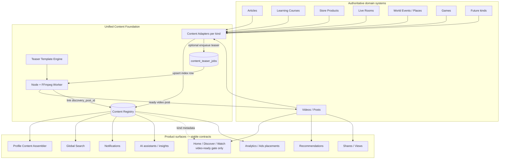

# Unified Content Foundation V1 — Architecture Design

**Status:** Architecture only — **no code, no migration, no commit/push**  
**Date:** 2026-07-27  
**Branch context:** design on top of Article Auto-Teaser / Creator Profile deeplink work  
**Decision needed:** human GO before any implementation branch

---

## 1. Executive answer

**Yes — UMTUBA can unify Articles, Videos, Courses, Products, Live, Events, Games, and future types under one Content layer**, but **not by collapsing everything into a single fat table**.

The correct shape is:

| Layer | Role |
| --- | --- |
| **Domain systems (authoritative)** | Keep owning schema, RLS, lifecycle, money, realtime, packages |
| **Content Registry (index)** | Thin polymorphic index: `kind + id + owner + visibility snapshot + href + optional discovery_post_id` |
| **Content Adapters** | Per-kind translators: domain row → registry row + profile card + search doc + notification payload |
| **Discovery / Teaser lane** | Optional **ready video post** on the existing Home feed — generalized from article teasers |
| **Template Engine (teaser)** | Shared FFmpeg/title-card pipeline parameterized by kind — not article-only |

**Home does not need redesign when a new kind appears** if Home continues to consume **only ready video discovery posts**, and new kinds publish teasers into that same gate.

**Profile becomes one assembler** over registry (or adapter fan-out), not N independent panels forever.

---

## 2. What exists today (ground truth)

### 2.1 No generic content registry

Closest cousins today:

- `posts` (bigint) — social video/text/image hub, **not** a polymorphic content root
- `search_entity_types` — search labels only
- Ads deliverable placements — surface taxonomy only
- Learning lesson `content_type` / blocks — course-internal only

### 2.2 Identifier split (structural)

| Domain | PK |
| --- | --- |
| `posts` | **bigint** |
| `articles`, learning_*, store_*, live_*, games, world_* | **uuid** |
| `profiles` | **uuid** (shared owner) |

Any unified model must use a **typed reference** `(content_kind, content_id)` plus optional `discovery_post_id bigint` — not a single UUID or bigint for everything.

### 2.3 Shared vs siloed

**Shared today**

- Owner = `profiles.id`
- Home/Discover/Watch = one video feed (`media_status=ready` + `video_path`)
- Sparse bridges: `posts.article_id`, `video_product_attachments`, world `*_post_links` / `*_live_links`
- Notifications inbox (typed events)
- Recommendations infra keyed by **post_id** (video)

**Siloed today**

- Learning OS, Store commerce, Live rooms, Games, World places/events, Articles body
- Profile: parallel fetches (videos / posts / articles / live) — no unified list RPC
- Search omits articles, learning, games, live, places (reserved types exist but inactive)

### 2.4 Highest-leverage reuse

| Asset | Reuse as |
| --- | --- |
| Canonical feed loaders | Discovery lane only |
| Media pipeline statuses on `posts` | Teaser readiness |
| `article_teaser_jobs` + FFmpeg worker | Prototype of **generic teaser jobs** |
| Creator deeplink `?article=` | Pattern for `?content=` / kind-specific deep links |
| Search entity registry | Extend kinds (don’t invent parallel search) |
| Recommendation signals on posts | Keep on discovery posts; map back via registry |
| Profile assemble page | Replace panel fan-out gradually |

---

## 3. Architecture diagram



### Discovery invariant (critical)

```text
Home feed item ⇔ posts row
  where post_type = 'video'
    and media_status = 'ready'
    and video_path is not null
```

New content kinds **enter Home only by producing such a post** (uploaded or generated teaser). Domains never invent a second Home stack.

---

## 4. Proposed data model

### 4.1 Content Registry (V1)

Thin index — **not** the source of truth for body, price, curriculum, or live state.

```text
content_registry
  id                 uuid PK                  -- registry row id (stable for analytics)
  content_kind       text NOT NULL            -- enum: article|video|course|product|live|event|game|…
  content_id         text NOT NULL            -- stringified domain id (uuid or bigint as text)
  owner_user_id      uuid NOT NULL → profiles
  title              text NOT NULL
  summary            text NULL
  href               text NOT NULL            -- canonical app path
  visibility         text NOT NULL            -- public|unlisted|private|owner_only
  lifecycle_status   text NOT NULL            -- domain-normalized snapshot
  discovery_post_id  bigint NULL → posts      -- Home teaser / primary video if any
  cover_path         text NULL
  published_at       timestamptz NULL
  locale             text NULL
  metadata           jsonb NOT NULL DEFAULT {} -- non-authoritative hints only
  created_at / updated_at

UNIQUE (content_kind, content_id)
INDEX (owner_user_id, published_at DESC)
INDEX (discovery_post_id) WHERE discovery_post_id IS NOT NULL
INDEX (content_kind, visibility, published_at DESC)
```

**Rules**

- Domain writes win; registry is projected via adapter/trigger/RPC after domain commit.
- Deleting domain content → delete or tombstone registry row (prefer tombstone for analytics).
- Never store full article body / lesson packages / order totals in `metadata`.

### 4.2 Generalized teaser jobs (evolve from `article_teaser_jobs`)

V1 path options:

**A (preferred evolutionary):** keep `article_teaser_jobs`, add parallel `content_teaser_jobs` with `content_kind + content_id`, migrate articles later.  
**B:** widen `article_teaser_jobs` → `content_teaser_jobs` in one migration (more churn).

Recommended columns for unified jobs:

```text
content_teaser_jobs
  id, content_kind, content_id, owner_user_id
  status: not_required|pending|processing|ready|failed
  teaser_source: uploaded|generated
  template_id, background_mode, background_asset_path
  audio_mode (silent V1), audio_asset_path
  generated_video_path, generated_post_id
  attempt_count, error_code
  UNIQUE (content_kind, content_id)
```

### 4.3 What stays in domain tables

| Kind | Stays authoritative in |
| --- | --- |
| Article | `articles` (+ body, publish) |
| Video | `posts` media columns |
| Course | `learning_*` tree |
| Product | `stores` / `store_products` + commerce |
| Live | `live_rooms` / sessions |
| Event/Place | `world_*` |
| Game | `games` + sessions |

### 4.4 Typed content reference (app-level)

```ts
type ContentRef = {
  kind: ContentKind;
  id: string; // uuid or decimal string for bigint posts
};
```

Deep links: `/articles/{id}`, `/learning/catalog/{slug}`, … remain canonical. Registry `href` mirrors them. Optional query `?content=kind:id` for prompts (generalize today’s `?article=`).

---

## 5. Component boundaries

### 5.1 Content Registry

**Owns:** index rows, uniqueness, owner indexes, visibility snapshots  
**Does not own:** payments, WebRTC, curriculum packages, FFmpeg rendering, feed ranking

### 5.2 Content Adapter (per kind)

**Owns:** map domain → registry; enqueue teaser; profile card DTO; search document fields; notification “open target”  
**Does not own:** other domains’ RLS; Home player UI

Interface sketch:

```text
ContentAdapter {
  kind
  upsertRegistry(domainRow) → ContentRegistryRow
  buildProfileItem(ref) → ProfileContentCard
  buildSearchHit(ref) → SearchHit | null
  resolveDeepLink(ref) → href
  shouldOfferAutoTeaser(domainRow) → boolean
  buildTeaserBrief(domainRow) → TeaserBrief  // title, CTA, template hints
}
```

### 5.3 Teaser Template Engine (independent)

**Owns:** title layout (RTL/LTR), background templates, FFmpeg arg builder, duration policy (5s V1), silent default  
**Does not own:** which domain enqueued the job; commerce; Learning enrollment

Generalize today’s:

- `lib/articles/articleTeaserTitleLayout.ts`
- `lib/articles/articleTeaserFfmpeg.ts`
- `scripts/media/articleTeaserWorker.ts`

into `lib/content/teaser/*` + worker that reads `content_kind` for CTA copy (“Read article” / “Open course” / “View product” …).

### 5.4 Discovery / Home

**Owns:** chronological (or later ranked) **video** feed only  
**Contract:** ready + path + signed URL  
**Enhancement without layout change:** overlay chips from registry via `discovery_post_id` → kind label (“Article”, “Course”, …) — additive, same chrome

### 5.5 Profile assembler

**Owns:** tabs/sections composition  
**Reads:** registry by `owner_user_id` filtered by kind  
**Does not:** embed Store checkout or Live studio

### 5.6 Cross-cutting surfaces

| Surface | How it uses the foundation |
| --- | --- |
| **Search** | Index from adapters into existing `search_entity_types` (+ activate reserved kinds) |
| **Recommendations** | Keep signals on discovery `post_id`; join registry for kind-aware ranking later |
| **Notifications** | Store `content_kind + content_id` (or registry id) instead of proliferating one-off columns |
| **Shares / views** | Primary on discovery posts; optional secondary domain counters via adapter |
| **Analytics / Ads** | Placements stay surface-based; creative/target can reference registry id |
| **AI** | Tools resolve `ContentRef` → adapter.fetchContext() with RLS of caller |

---

## 6. Teaser as a **general discovery layer**

Today: Article → (optional) video post with `article_id` → Home.

Target:

```text
Any publishable ContentRef
  → Adapter decides teaser policy
  → uploaded video linked OR content_teaser_jobs pending
  → Worker renders kind-aware 5s MP4
  → posts ready + discovery_post_id on registry
  → Home shows it like any video
  → Chip / deeplink opens canonical domain surface
```

**Policy matrix (V1 suggestions)**

| Kind | Auto-teaser default | Uploaded video |
| --- | --- | --- |
| Article | Yes (already) | Prefer upload |
| Course | Optional / opt-in | Trailer upload |
| Product | Opt-in (commerce rules) | Shop video |
| Live | No auto (use live lobby) | Clip after ended optional later |
| Event | Opt-in | Promo clip |
| Game | Opt-in | Trailer |
| Native video post | N/A (is the discovery object) | — |

Live/Games may **skip** auto-teaser in V1 and only register for Profile/Search.

---

## 7. Home without per-kind edits

**Stable Home contract**

1. Loader unchanged: `HomeFeedLoader` → `getDiscoverVideosServer`
2. Gate unchanged: ready video posts only
3. New kinds = new rows that satisfy the gate
4. Optional metadata hydration: batch `registry` by `discovery_post_id` (like today’s article title hydration)

**Forbidden for foundation work**

- Second feed stack
- CSS-fake videos
- Kind-specific player forks on Home

---

## 8. Profile from one layer

**Target UX:** All / Posts / Videos / Articles / Courses / Products / … as **filters over registry**, not separate micro-apps.

**V1 transitional:** keep existing panels; add registry-backed “All” timeline.  
**V2:** migrate Articles/Courses panels to adapter cards.  
**V3:** deprecate per-domain list queries where registry coverage is complete.

Professional profile chrome (cover, bio, tabs) stays; content grids consume registry DTOs.

---

## 9. Do we need Registry / Adapters / Template Engine?

| Component | Needed? | Why |
| --- | --- | --- |
| **Content Registry** | **Yes** | Single owner index for profile/search/AI without merging schemas |
| **Content Adapter per kind** | **Yes** | Prevents god-service; isolates RLS and lifecycle |
| **Teaser Template Engine** | **Yes (extract)** | Avoid copying FFmpeg pipelines per domain; articles already proved the pattern |
| Fat `content` table with all bodies | **No** | Breaks Learning/Store/Live boundaries and RLS |
| Replacing `posts` entirely | **No** | Social + media pipeline already centered there |

---

## 10. Phased plan

### V1 — Foundation spine (lowest risk)

1. Design freeze (this doc) + human GO  
2. Additive `content_registry` migration (Git-only until apply GO)  
3. Adapters: **article**, **video (post)**, **product** (read-only index first)  
4. Project existing published articles + ready videos into registry (backfill job)  
5. Extract teaser template engine from article modules (behavior-preserving)  
6. Profile “All” optional section from registry (no Home redesign)  
7. Tests: uniqueness, adapter projection, no feed before teaser ready  

**Out of V1:** Learning/Games/Live full adapters, ranking ML, music library

### V2 — Discovery generalization

1. `content_teaser_jobs` (or widen article jobs)  
2. Course + Event opt-in teasers  
3. Search: activate articles + courses (+ reserved live/places carefully)  
4. Notifications: content ref fields  
5. Deeplink prompt generalized (`content` query) on profile  

### V3 — Platform coherence

1. Remaining adapters (Live, Games, …)  
2. Recommendation ranking that uses registry kind  
3. AI tool surface over ContentRef  
4. Deprecate redundant profile list paths  
5. Analytics dashboards keyed by registry id  

---

## 11. Migration needs (future — not now)

| Migration | Purpose |
| --- | --- |
| `content_registry` + RLS | Index |
| Optional `content_teaser_jobs` | Generalized teasers |
| Backfill SQL/scripts | Project existing articles/videos/products |
| Search entity activation rows | Extend `search_entity_types` |
| Possibly `posts` metadata jsonb hint | Non-authoritative kind chip (optional; prefer join via registry) |

**Do not** rewrite Learning/Store schemas into one table.  
**Do not** apply remote migrations until explicit GO.

---

## 12. Optimal execution order

1. Registry schema + article/video adapters + backfill  
2. Extract Template Engine (no product behavior change)  
3. Profile All from registry  
4. Search activation for articles  
5. Generalize teaser jobs beyond articles  
6. Course/product teaser policies  
7. Notifications + recommendations joins  
8. Live/Games/Events adapters last (different lifecycles)

---

## 13. Risks

| Risk | Mitigation |
| --- | --- |
| Dual-write drift (domain vs registry) | Same-transaction RPC or transactional outbox; reconciliation cron |
| Over-wide `metadata` jsonb | Strict allowlist per adapter; reject unknown keys in tests |
| ID confusion bigint vs uuid | Always store `content_id` as text + kind; helpers parse safely |
| Premature Home redesign | Hard invariant: video-ready gate only |
| RLS holes via registry SELECT | Registry visibility ≤ domain visibility; no body leakage |
| Teaser spam flooding Home | Rate limits, opt-in per kind, quality gates |
| Big-bang migration | Phased adapters; feature flags |
| Worker/ops load | Keep async jobs; silent V1 audio |

---

## 14. Explicit non-goals (architecture phase)

- Writing application code now  
- Creating/applying migrations now  
- Merging feature branches into `alpha-0.2` as part of this design  
- Unifying payments, LiveKit, or Learning packages into Content  
- Building a platform music library  

---

## 15. Recommended human decisions before coding

1. Approve **Registry + Adapters + Template Engine** (not fat table).  
2. Approve Home invariant (discovery = ready video posts only).  
3. V1 adapter set: article + video (+ product read-only?).  
4. Teaser generalization timing: after registry spine vs parallel.  
5. Branch name when GO: e.g. `office/unified-content-foundation-v1`.  

---

## 16. One-sentence strategy

**Keep domains sovereign; publish a thin Content Registry; discover via the existing video teaser lane; render teasers with one Template Engine; assemble Profile/Search/AI from adapters — so every future product plugs into the same spine without rewriting Home.**
