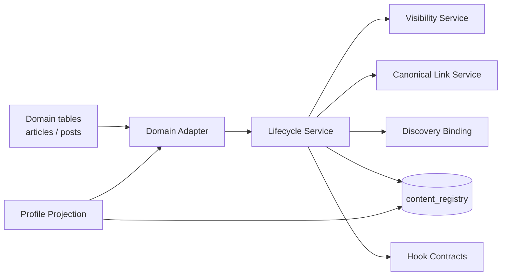

# Unified Content Services V2

**Status:** Implemented on `office/unified-content-services-v2` (architecture + code)  
**Parent:** Unified Content Foundation V1 (`c72e0d2`)  
**Migrations:** None new — reuses `20260868` registry RPCs

---

## 1. Purpose

Content Services sit **above** `content_registry` and **beside** domain adapters. They remove duplicated lifecycle / visibility / href / discovery / profile projection logic without making the registry the domain source of truth.

---

## 2. Service boundaries

| Service | Owns | Does not own |
| --- | --- | --- |
| **Lifecycle** | register/sync/deactivate orchestration, hook emission | Domain writes, FFmpeg, Home feed |
| **Visibility** | normalize → public/unlisted/private; viewer eligibility helpers | Source RLS |
| **Canonical Link** | allowlisted `/articles/{uuid}`, `/watch?post={id}` | Client-supplied hrefs |
| **Discovery Binding** | validate + bind ready posts; reject owner mismatch / teaser-as-video | Creating posts |
| **Profile Projection** | Profile All cards, pagination cursor, badges | Articles/Videos tab queries |
| **Adapter Runtime** | allowlisted adapter map | Client-chosen kinds |
| **Hooks** | typed descriptors only | Queues, notifications, analytics delivery |

---

## 3. Adapter runtime

- `registerContentAdapter` — reject duplicate kinds
- `getRegisteredAdapter` / `requireContentAdapter` — fail closed for unknown kinds
- `ensureBuiltinContentAdaptersRegistered()` — article + video only
- Adapters implement `validateSource` then call Lifecycle (not raw upsert for business rules)

---

## 4. Lifecycle flow

1. Adapter `validateSource` (missing source → fail, no orphan public row)
2. Canonical Link builds href internally
3. Visibility normalized
4. Discovery post resolved only if ready + owner-safe
5. `upsert_content_registry_item` RPC
6. Hooks: published / unpublished / visibility / discovery

---

## 5. Discovery binding flow

- Article: discovery post may have `article_id = article` (or bind after teaser ready)
- Video: only independent ready posts (`article_id is null`); post id must equal source id
- Reject different owners; reject non-ready media
- Auto-teaser worker → `syncArticleDiscoveryPost` → `bindDiscoveryPost`

---

## 6. Profile projection flow

- Reads registry (RLS)
- Filters by viewer access helpers
- Projects cards via adapter + badges (`linked_article`, `independent_video`)
- Cursor: `published_at` + `id`
- Soft-fail if table missing

---

## 7. Hook contracts

Events: `onContentPublished`, `onContentUnpublished`, `onVisibilityChanged`, `onDiscoveryReady`, `onContentDeleted`  
Bounded JSON; no article body / video_path. No-op listeners by default.

---

## 8. Security boundaries

- No direct client writes to registry
- Canonical href allowlist only
- Owner mismatch rejected in lifecycle deactivate + discovery bind
- Registry RLS from V1 unchanged
- Source RLS remains final gate

---

## 9. Deferred (not V2)

Learning / Store / Live / Games / Events adapters · Search ranking · Recommendations · Notification delivery · Analytics pipelines · AI · Home redesign · New migrations unless proven necessary

---

## 10. Compatibility

- Home still `posts` ready-only via `HomeFeedLoader`
- Article Auto-Teaser worker unchanged rendering; discovery sync via services
- Articles / Videos profile tabs unchanged
