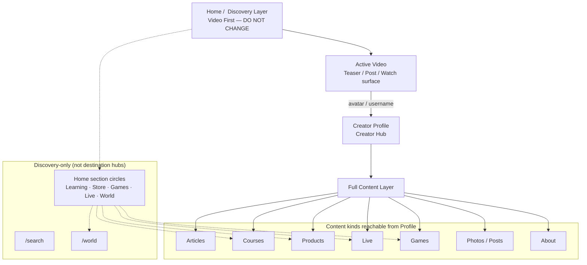
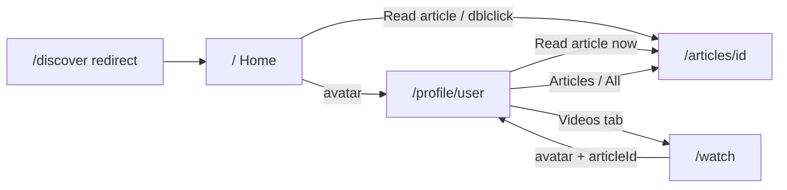

# Unified Experience / Page Consolidation V1

**Status:** Architecture review only (no implementation)
**Branch base:** `alpha-0.2` @ `f053709` (Media Processing Foundation V1 closed)
**Hard constraint:** Do **not** change the Video-First Home (`/`) — feed, Discover experience, Watch player behavior, swipe, video order, or engagement tools.

---

## 1. Purpose

UMTUBA's product spine is:

```text
Home (Discovery Layer)
  → Video
  → Creator Profile (Creator Hub)
  → Full content (article / course / product / live / …)
```

Home is **not** an articles page, store page, or courses page. All content kinds should be *discoverable* from Home, then deepened via Creator Profile and dedicated Content surfaces.

This document audits current pages/routes and proposes consolidation **without** executing merges, deletes, moves, or refactors.

---

## 2. Target architecture (canonical)



**Invariant:** Home remains Discovery. Shortcuts from Home circles into Learning/Store/Games/Live/World are allowed as *entry ramps*, but the preferred deep path for creator-owned content is Profile → Content.

---

## 3. Classification model

| Class | Role |
| --- | --- |
| **Discovery** | Find content / creators; video-first surfaces |
| **Creator** | Creator Hub + creation entry points |
| **Content** | Full consumption of a single entity |
| **Internal** | Signed-in workspaces (create, settings, seller, advertise, messages) |
| **Admin** | Staff moderation / ops |
| **Auth / Legal / Marketing** | Session and policy surfaces (orthogonal) |

---

## 4. Current pages inventory (all `app/**/page.tsx`)

**Count:** 131 route pages under `app/`.

### 4.1 Discovery

| URL | File | Notes |
| --- | --- | --- |
| `/` | `app/page.tsx` | Canonical Video-First Home — **locked** |
| `/discover` | `app/discover/page.tsx` | Redirect alias → `/?…` |
| `/watch` | `app/watch/page.tsx` | Parallel vertical Watch stack |
| `/search` | `app/search/page.tsx` | Global search |
| `/world`, `/world/search`, `/world/place/[slug]`, `/world/city/[slug]` | `app/world/**` | World discovery |
| `/live` | `app/live/page.tsx` | Live lobby |
| `/games` | `app/games/page.tsx` | Hub stub (“Play later”) |
| `/saved` | `app/saved/page.tsx` | Saved content |
| `/city/[citySlug]` | `app/city/[citySlug]/page.tsx` | Experimental / placeholder |
| `/post-journey` | `app/post-journey/page.tsx` | Globe journey |
| `/feed` | `app/feed/page.tsx` | Legacy; prod `notFound()` |
| `/journey-pro` | `app/journey-pro/page.tsx` | Experimental lab |

### 4.2 Creator

| URL | File | Notes |
| --- | --- | --- |
| `/profile` | `app/profile/page.tsx` | Resolver → username / settings / login |
| `/profile/[username]` | `app/profile/[username]/page.tsx` | Creator Hub (`?tab=` `?article=`) |
| `/create/video` | `app/create/video/page.tsx` | Upload |
| `/create/article` | `app/create/article/page.tsx` | Write article |
| `/creator/insights` | `app/creator/insights/page.tsx` | Creator insights |

### 4.3 Content

| URL | File | Notes |
| --- | --- | --- |
| `/articles/[articleId]` | `app/articles/[articleId]/page.tsx` | Full article |
| `/live/[roomId]` | `app/live/[roomId]/page.tsx` | Live room |
| `/learning/**` (learner tree) | `app/learning/**` | Courses, lessons, activities, community |
| `/store/[storeSlug]`, PDP, cart, checkout, orders | `app/store/**` | Commerce consumption |
| Learning catalog / course pages | `app/learning/catalog/**`, `courses/**` | Course content |

### 4.4 Internal

| URL family | Notes |
| --- | --- |
| `/messages`, `/notifications`, `/settings`, `/rewards` | Account utilities |
| `/seller/**` | Seller workspace (+ `/seller/products*` aliases) |
| `/advertise/**` | Advertiser workspace |
| `/learning/instructor/**` | Instructor authoring / ops |
| `/live/media-lab` | Internal media lab |

### 4.5 Admin

| URL family | Notes |
| --- | --- |
| `/admin/ads/**` | Ads ops |
| `/admin/store/**` | Store ops |

### 4.6 Auth / Legal / Marketing

| URL | Notes |
| --- | --- |
| `/login`, `/signup`, `/forgot-password`, `/auth/update-password` | Auth |
| `/register` | Redirect → `/signup` |
| `/invite/[code]` | Referral |
| `/terms`, `/privacy` | Legal |
| `/welcome` | Marketing landing (ex-home) |

---

## 5. Pages that should remain

| Surface | Why |
| --- | --- |
| `/` Home | Official Discovery Layer — **no changes in this phase** |
| `/watch` | Secondary video consumption; profile Videos deep-link here |
| `/profile/[username]` | Creator Hub spine |
| `/articles/[articleId]` | Full article Content surface |
| `/live`, `/live/[roomId]` | Live discovery + room |
| `/learning/**` (learner + instructor trees) | Domain depth; keep independent |
| `/store/**` buyer + PDP | Commerce Content / checkout |
| `/seller/**`, `/advertise/**`, `/admin/**` | Role workspaces |
| `/create/video`, `/create/article` | Creation Internal |
| `/messages`, `/notifications`, `/settings`, `/search` | Core utilities |
| `/welcome`, `/terms`, `/privacy`, auth routes | Marketing / legal / session |
| `/games` | Keep as stub until Games runtime |
| `/world/**` | Distinct discovery domain |

---

## 6. Pages that can be merged (later — not now)

| Candidate | Proposal | Impact |
| --- | --- | --- |
| `/discover` primary nav entry | Retire as **label** in nav; keep redirect forever for deeplinks | Clears duplicate Home/Discover chrome; **must not** alter Home feed |
| `/seller/products*` → `/seller/store/products*` | Single seller product tree; keep redirects | Alias hygiene |
| `/register` → `/signup` | Already merged via redirect | Done |
| `/store/shops/[id]`, `/store/products/[id]` | Keep as **resolvers** to slug PDPs (not user-facing destinations) | Already pattern |
| `/city/[slug]` → `/world/city/[slug]` | Fold placeholder city into World | Removes parallel “city” concept |
| `/feed`, `/journey-pro` | Gate / eventual retire after zero traffic | Legacy cleanup |

---

## 7. Pages that should become Tabs

| Candidate | Where | Notes |
| --- | --- | --- |
| Articles, Videos, About, Live | **Already tabs** on Profile | Keep; extend model |
| Future: Courses, Products, Photos | Profile tabs | Add when data exists — **no radical redesign** |
| Posts vs All | Stay as tabs | Posts need outbound links later |
| Learning community sections | Already nested under course | Optional stronger tab shell inside course (not global) |
| Seller store sections | Seller shell tabs | Already multi-page; optional shell consolidation later |

**Profile tab readiness (Creator Hub):**

| Tab | Today | Target |
| --- | --- | --- |
| All | Real (`content_registry`) | Keep as hub timeline |
| Posts | Real display | Later: Photos / post detail |
| Videos | Real → `/watch?post=` | Keep |
| Articles | Real → `/articles/[id]` | Keep |
| Live | Conditional | Keep |
| About | Real | Keep |
| Courses | Missing | Future tab → `/learning/...` |
| Products | Missing | Future tab → store / creator shop |
| Photos | Missing (Posts adjacent) | Future rename/split |

---

## 8. Pages that should become Modals

| Candidate | Host surface | Notes |
| --- | --- | --- |
| Comments / shop / AI panels | Watch / Home overlays | **Already** panel/modal-like |
| Profile linked-article prompt | Profile | Already inline prompt (`?article=`) — keep lightweight |
| Quick “Read article” confirm | Optional later on Home | **Do not** implement now; Home locked |
| Create chooser (video vs article) | Create entry | Optional sheet instead of two cold starts |
| Simple settings sub-panels | `/settings` | Optional later |

Avoid converting full Content pages (article, course player, PDP, live room) into modals.

---

## 9. Pages that must stay independent

| Surface | Reason |
| --- | --- |
| `/` Home | Official Discovery product |
| `/articles/[id]` | Full reading experience |
| `/watch` | Distinct loader/overlays vs Home (short-term) |
| Learning course / lesson / activity trees | Deep domain UX + deeplinks |
| Store cart / checkout / orders | Transactional |
| Live room | Immersive; bottom nav already hidden |
| Seller / Advertise / Admin | Permissioned apps-in-app |
| Auth / Legal / Welcome | Orthogonal lifecycle |

---

## 10. Impact of each proposed change (when executed later)

| Change | UX impact | Tech impact | Home impact |
| --- | --- | --- | --- |
| Nav: remove Discover label | Cleaner primary nav | Update `APP_NAV_ITEMS`, mobile nav, tests | **None** to feed |
| Keep `/discover` redirect | Deeplinks survive | Already redirects | None |
| Profile tabs: Courses/Products | Creator Hub completeness | New panels + data projections | None |
| Unify article entry (policy) | Funnel: Profile-first vs Home shortcut | CTA policy only | **Forbidden** unless explicit GO |
| Shared player primitives Home↔Watch | Consistency | Extract shared components | Must not change swipe/order/tools |
| World absorbs `/city` | One geo story | Redirect + docs | None |
| Alias hygiene seller/store | Fewer duplicate URLs | Redirects + nav | None |
| Retire `/feed` / journey-pro | Less noise | Delete after analytics | None |

---

## 11. Risks

| Risk | Detail |
| --- | --- |
| Deeplink breakage | `/discover?post=`, `/watch?post=`, `/profile?article=`, notification builders in `app/lib/nav/routes.ts` |
| Nav contract tests | `shellCoherence`, `mobileNav`, page assembly encode Home≡Discover active rules |
| Dual video stacks | `DiscoverExperience` vs `WatchExperience` — different overlays/commerce |
| Funnel split | Home “Read article” skips Profile (exists today in `DiscoverVideoCard`) vs Profile “Read article now” |
| Over-merging Learning/Store | High page count is domain depth, not duplication |
| Accidental Home edits | Any consolidation PR must exclude Home feed / player / swipe |
| Experimental gates | `isExperimentalRouteAvailable()` — don’t leak lab UI |

---

## 12. Execution order (future phases — not this review)

1. **Docs + IA labeling** — Treat Home as Discovery; Discover as alias; Profile as Creator Hub *(this document)*.
2. **Nav chrome hygiene** — Discover label retirement; keep redirects; **zero Home feed changes**.
3. **Profile Creator Hub readiness** — Tab model for Courses / Products / Photos without visual redesign.
4. **Content-flow policy** — Decide Profile-mediated vs Home direct article CTA (policy only; Home change needs GO).
5. **Alias hygiene** — Seller products, city→world, legacy gates.
6. **Video surface map** — Shared primitives Home/Watch without forcing one route.
7. **Workspace shells** — Seller / Advertise / Admin / Learning: collapse internal aliases only.
8. **Legacy retirement** — `/feed`, `/journey-pro` after traffic proof.
9. **Games** — Leave hub until runtime; don’t force into Profile prematurely.

---

## 13. Priorities

| Priority | Item | Rationale |
| --- | --- | --- |
| P0 | Protect Home Video-First | Official design; hard lock |
| P0 | Preserve Home → Video → Profile → Content path | Validated by Media Processing V1 |
| P1 | Profile as Creator Hub (tab readiness) | Future content kinds need a home |
| P1 | Nav Discover alias clarity | Reduces IA confusion |
| P2 | Alias / legacy hygiene | Low risk cleanup |
| P2 | Watch/Home shared primitives map | Consistency without merge |
| P3 | Games / Photos / Courses / Products on Profile | After domain data exists |
| P3 | Retire experimental routes | After metrics |

---

## 14. Current navigation audit (snapshot)

> **Contract Sync V1:** Official frozen contracts live in `PLATFORM_NAVIGATION_ARCHITECTURE_V1.md`. Discover is **not** a primary nav label.

| Layer | Source | Destinations |
| --- | --- | --- |
| Desktop top | `AppTopNav` + `APP_NAV_ITEMS` | Home, World, Learning, Live, Messages (+ Search) |
| Mobile bottom | `MOBILE_PRIMARY_NAV_ITEMS` | Home, Live, Messages, Profile |
| User menu | `userMenuItems.ts` | Profile, Saved, Learning, Rewards, Notifications, Settings, Store, Seller, Wishlist, Advertise |
| Home circles | `HomeSectionCircles` | Learning, Store, Games, Live, World, Search, Messages, Create |

**Discover alias:** `/discover` forever redirects to `/` with query preserved. Desktop/mobile **Home** stays active for `/discover` paths. Discover must not reappear as a primary chrome label.

---

## 15. Current content flow audit



**Preferred product path:** Home → Profile (`?article=`) → Read article now → Article.
**Parallel shortcut today:** Home → Article (skips Profile). Policy decision deferred; **no Home change in V1 review**.

---

## 16. Out of scope for this review

- Any Home / DiscoverExperience / Watch player / swipe / ranking / engagement changes
- Route merges, deletes, file moves, wide refactors
- Migrations / DB changes
- Commit / push / implementation

---

## 17. Key file references

- Nav contracts: `app/lib/nav/routes.ts`, `app/lib/nav/mobileNav.ts`, `app/lib/nav/userMenuItems.ts`
- Home: `app/page.tsx`, `app/components/home/HomeFeedLoader.tsx`, `app/discover/components/*`
- Discover alias: `app/discover/page.tsx`
- Watch: `app/watch/page.tsx`
- Profile: `app/profile/[username]/page.tsx`, `ProfileExperience.tsx`, `ProfileTabs.tsx`, `ProfileLinkedArticlePrompt.tsx`
- Chrome: `app/components/AppChrome.tsx`, `AppTopNav.tsx`, `AppMobileBottomNav.tsx`
