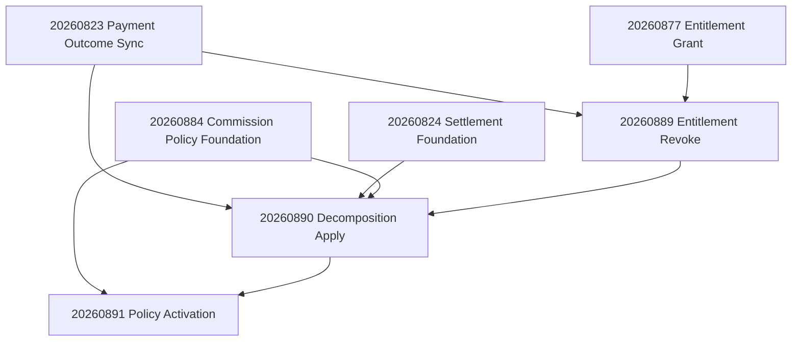

# Commerce Chain Verification & Migration Apply Readiness V1

Capability: `commerce.ops.chain_migration_apply_readiness_v1`  
Branch: `office/commerce-chain-migration-apply-readiness-v1`  
HEAD (authoritative base): `be87fb30c2c7ba15d66f8540e5e6c57e181649f6`  
(`origin/office/commerce-commission-policy-activation-v1`)

**Remote database status: NOT INSPECTED / NOT MODIFIED**  
**Repository decision: `READY_FOR_SEPARATE_REMOTE_APPLY_GO`** (human GO still required)

This document is desktop-owned migration apply readiness. It does **not** duplicate laptop-owned Commerce launch readiness.

---

## 1. Authoritative Commerce chain and HEAD

| # | Capability | Commit (ancestor of HEAD) |
| --- | --- | --- |
| 1 | Live Payment Production Gate | `f376d5e` |
| 2 | Transactional Notifications | `674b4d1` |
| 3 | Seller Payout Rails | `9a93fc9` |
| 4 | Refund Operations Surface | `100c98e` |
| 5 | Digital Entitlement Revoke on Refund V1 | `306a023` |
| 6 | Commission Decomposition Bridge Apply V1 | `7d90a05` |
| 7 | Commission Policy Activation V1 | `8b6caa0` (+ history reconcile merge `be87fb3`) |

Static verifier: `scripts/verify-commerce-chain-migration-apply-readiness.mjs`  
Focused tests: `lib/store/commerceChainMigrationApplyReadiness.test.ts`

---

## 2. Migration inventory and exact order

### New migrations requiring remote apply (this GO gate)

| Order | File | Role |
| --- | --- | --- |
| 1 | `20260889_store_digital_entitlement_revoke_on_refund_v1.sql` | Revoke digital entitlements after trusted refund |
| 2 | `20260890_store_commission_decomposition_bridge_apply_v1.sql` | Persist commission decomposition after capture+allocate |
| 3 | `20260891_store_commission_policy_activation_v1.sql` | Activate/deactivate lifecycle; one active policy per currency |

### Prerequisite migrations that must already be applied

| File | Why |
| --- | --- |
| `20260823_store_payment_outcome_sync_v1.sql` | Capture/refund outcome events |
| `20260824_store_merchant_settlement_foundation_v1.sql` | Settlement allocate / unwind |
| `20260877_store_digital_entitlement_grant_v1.sql` | Entitlement table + status model (89) |
| `20260884_store_commission_policy_foundation_v1.sql` | Policy registry + resolve/split (90/91) |
| `20260887_store_commerce_transactional_notifications_v1.sql` | Notifications (chain history; **not** commission activation) |
| `20260888_store_refund_operations_surface_v1.sql` | Refund ops surface (chain history) |

Plus earlier store foundations (`orders`, `order_items`, `payment_attempts`, `stores`, marketplace supplier columns as already deployed for this product line).

**Exact remote application order for the new slice:**

```text
20260889 → 20260890 → 20260891
```

Do not reorder. Do not skip prerequisites.

---

## 3. Dependency matrix (89 / 90 / 91)



| Migration | Hard SQL deps | Soft / product deps |
| --- | --- | --- |
| 89 | 23, 77, orders/payment_attempts | 88 refund path callers |
| 90 | 23, 24, 84, orders/order_items | Capture apply wire-in; 89 for full chain order |
| 91 | 84 | 90 for capture-time version story; unique-index clean data |

---

## 4. Obsolete 20260887 disposition

| Item | Disposition |
| --- | --- |
| Historical commit `fded934` (`feat(commerce): activate default commission policies`) | Ancestor of HEAD via reconcile merge; **not** in active tree |
| Obsolete file `20260887_store_commission_policy_activation_v1.sql` | **ABSENT** from HEAD working tree |
| Active `20260887_*` | `20260887_store_commerce_transactional_notifications_v1.sql` only |
| Authoritative activation | `20260891_store_commission_policy_activation_v1.sql` only |
| Action | Do **not** restore, duplicate, or apply the obsolete activation migration |

Static verifier fails closed if the obsolete activation filename reappears or if activate RPC is defined outside 91.

---

## 5. Pre-apply checklist (DBA / ops)

Remote DB is **not** inspected by this task. Before human GO, operators must confirm on the **target** database:

1. Prerequisites listed in §2 are already applied (`supabase_migrations.schema_migrations` / project history).
2. `20260889`, `20260890`, `20260891` are **not** already applied.
3. Backup / PITR recovery point taken.
4. Maintenance window agreed (short exclusive locks on policy/entitlement tables possible).
5. **Commission multi-active preflight (blocking for 91):**

```sql
-- STOP if any row returned
SELECT currency, count(*) AS active_count
FROM public.store_commission_policies
WHERE status = 'active'
GROUP BY currency
HAVING count(*) > 1;
```

If rows return: demote extras to `superseded`/`disabled` with closed `effective_to` **before** applying 91. Do not invent rates; keep historical amounts intact.

6. Confirm no obsolete activation objects from `fded934` exist (should be none if never applied):

```sql
SELECT to_regprocedure('public.activate_store_commission_policy(text,integer,text,text)');
-- After 91 apply this should exist; before 91 it should be NULL unless an obsolete seed was applied.
```

7. Application deploy that includes TS wire-ins for revoke / decomposition / activation is ready to ship **with or immediately after** migrations (same release train preferred).

---

## 6. Exact proposed application commands — **DO NOT RUN YET**

> **HUMAN GO GATE:** Do not execute until an explicit remote-apply GO is given in a separate instruction.

Proposed sequence (illustrative; use the project's standard Supabase migration apply path):

```bash
# DO NOT RUN YET — pending separate remote-apply GO
# 1) Confirm branch/commit
git rev-parse HEAD
# expect: be87fb30c2c7ba15d66f8540e5e6c57e181649f6 (or later FF that still contains 89/90/91)

# 2) Static repo verification (safe anytime)
node scripts/verify-commerce-chain-migration-apply-readiness.mjs

# 3) Apply ONLY after GO, one migration at a time, stop on first failure
# (replace with the team's approved supabase/db apply invocation)
# supabase db push --include-all   # DO NOT RUN YET
# OR apply files individually in order:
#   20260889 → verify → 20260890 → verify → 20260891 → verify
```

Preferred operational pattern: apply **one file**, run post-apply checks for that file, then continue.

---

## 7. Post-apply verification queries / checks

### After 20260889

```sql
SELECT to_regprocedure(
  'public.revoke_store_digital_entitlements_after_refund(uuid,text,text)'
) IS NOT NULL AS revoke_rpc_present;

SELECT column_name
FROM information_schema.columns
WHERE table_schema = 'public'
  AND table_name = 'store_digital_entitlements'
  AND column_name = 'revoked_at';

SELECT c.relrowsecurity AND c.relforcerowsecurity AS rls_forced
FROM pg_class c
JOIN pg_namespace n ON n.oid = c.relnamespace
WHERE n.nspname = 'public'
  AND c.relname = 'store_digital_entitlement_revoke_events';
```

### After 20260890

```sql
SELECT to_regprocedure(
  'public.apply_store_commission_decomposition_after_capture(uuid,text,text)'
) IS NOT NULL AS apply_rpc_present;

SELECT to_regprocedure(
  'public.mark_store_commission_decomposition_after_refund(uuid,text)'
) IS NOT NULL AS mark_rpc_present;

SELECT to_regprocedure(
  'public.get_store_commission_decomposition_for_attempt(uuid)'
) IS NOT NULL AS get_rpc_present;
```

### After 20260891

```sql
SELECT indexname
FROM pg_indexes
WHERE schemaname = 'public'
  AND indexname = 'store_commission_policies_one_active_per_currency_uidx';

SELECT to_regprocedure(
  'public.activate_store_commission_policy(text,integer,text,text)'
) IS NOT NULL AS activate_rpc_present;

SELECT to_regprocedure(
  'public.deactivate_store_commission_policy(text,integer,text,text)'
) IS NOT NULL AS deactivate_rpc_present;

-- Still at most one active per currency
SELECT currency, count(*) AS active_count
FROM public.store_commission_policies
WHERE status = 'active'
GROUP BY currency
HAVING count(*) > 1;
```

### Application smoke (post-deploy)

- Capture path still succeeds (allocate → commission apply → entitlement → release).
- Full-order refund still succeeds (settlement unwind → Sync refunded → entitlement revoke → commission mark).
- No client-callable execute on money/activation RPCs (`anon`/`authenticated`).

---

## 8. Stop conditions

Stop the apply sequence immediately if any of the following occur:

| Condition | Action |
| --- | --- |
| Prerequisite missing | Abort; do not apply 89/90/91 |
| Multi-active commission rows before 91 | Abort before 91; repair data first |
| Any migration SQL error | Abort; do not continue to next file |
| Post-apply RPC missing | Abort; escalate; do not deploy app that requires the RPC |
| Unique index creation fails on 91 | Abort; clean multi-active data; retry 91 only |
| Privilege/RLS regression suspected | Abort; review grants before proceeding |

---

## 9. Rollback vs forward-repair

| Migration | Destructive rollback | Recommended strategy |
| --- | --- | --- |
| 89 | Dropping revoke events loses audit | **Forward-repair**: keep table; fix function via `CREATE OR REPLACE` |
| 90 | Dropping decomposition events loses money audit | **Forward-repair** only; never delete applied decomposition rows |
| 91 | Dropping unique index re-allows ambiguous actives | **Forward-repair**: replace activate/resolve functions; keep index |

**Do not** `DROP TABLE` of entitlement revoke events, commission decomposition events, or activation events in production. Historical commission amounts and entitlement revoke ledgers are audit artifacts.

If 91 fails after 90 succeeded: leave 89+90 applied; repair data; re-apply 91 only.

---

## 10. Production operational notes

- Migrations are additive (`IF NOT EXISTS` / `CREATE OR REPLACE`) and match repository conventions.
- 91 unique index is the main data-dependent failure mode.
- Capture continues to resolve policy at capture timestamp; decomposition stores `policy_code`/`policy_version`.
- Refunds revoke entitlements and mark decomposition `superseded_by_refund` without deleting history.
- Settlement/payout booking amounts remain full capture (unchanged).
- No active commercial policy seed in 91 — operators activate drafts intentionally after apply.

### Locks / rewrite risks

| Risk | Notes |
| --- | --- |
| `ADD COLUMN revoked_at` | Metadata-only on modern Postgres; brief lock |
| New tables/indexes | Create locks; low rewrite risk |
| Unique index on `store_commission_policies` | Validates existing rows; fails if duplicates |
| Function replace | Catalog update; short lock |

No large backfills in 89/90/91.

---

## 11. DBA checklist (summary)

- [ ] Backup / PITR confirmed  
- [ ] Prerequisites present  
- [ ] Multi-active commission preflight clean  
- [ ] Apply 89 → verify  
- [ ] Apply 90 → verify  
- [ ] Apply 91 → verify  
- [ ] App release aligned  
- [ ] Smoke capture + refund  
- [ ] Record applied versions in ops log  

---

## 12. Explicit GO / NO-GO gate

| Layer | Status |
| --- | --- |
| Repository static readiness | **PASS** |
| Remote database | **NOT INSPECTED / NOT MODIFIED** |
| Remote migration apply | **NOT PERFORMED** |
| Human remote-apply GO | **REQUIRED (separate instruction)** |

**Repository decision: `READY_FOR_SEPARATE_REMOTE_APPLY_GO`**

Remote apply remains blocked until an explicit human GO that authorizes database mutation.
